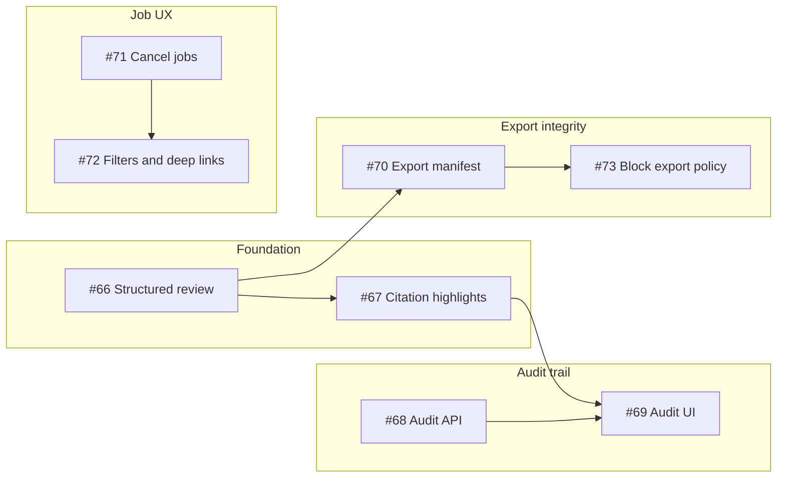

# P1 plan — Operator trust

Handoff doc for implementing **P1 — Operator trust** on ExtractFlow. Use this in a new chat after P0 release work is on `dev` / `master`.

**Roadmap:** [PRODUCTION_ROADMAP.md](PRODUCTION_ROADMAP.md)  
**Milestone:** [P1: Operator trust](https://github.com/blakeox/extractflow/milestone/2) (GitHub milestone #2)

---

## Repo baseline (as of 2026-05-24)

| Item                      | Value                                                                                              |
| ------------------------- | -------------------------------------------------------------------------------------------------- |
| Integration branch        | `dev` (default)                                                                                    |
| Production branch         | `master`                                                                                           |
| Latest `dev` tip          | `2f5349e` — _Sync dev with master (#106)_                                                          |
| Latest `master` tip       | `bc94a84` — _Release: promote dev to master (#105)_                                                |
| `dev` vs `master` content | **Identical trees** (squash releases → different SHAs, same files)                                 |
| Open CodeQL alerts        | 0                                                                                                  |
| LangExtract nightly       | Smoke gate (`receipt-basic`, `statement-basic` on `qwen2.5:3b`) required; full suite informational |

**Release scripts**

- Promote: `./scripts/release-dev-to-master.sh` → squash merge PR to `master`
- Sync pointers: `./scripts/sync-master-to-dev.sh` → opens `master` → `dev` PR when trees match but tips differ (branch rules: no merge commits on `dev`, no force-push)

**Verify clean before starting P1**

```bash
git checkout dev && git pull origin dev
git status   # should be clean
```

---

## P1 goal

**Humans can defend exports; audit is real—not mock UI.**

### Gate (exit criteria)

One operator playbook run end-to-end:

1. Upload PDF → extraction completes
2. Review (including non-scalar fields) with citation context
3. Export with integrity metadata
4. Audit page shows real events for upload, review, export

No static mock data on the Audit page; APIs and DB back the trail.

---

## GitHub issues (all open in milestone P1)

| Issue                                                   | Title                                                                   | Depends on                                          |
| ------------------------------------------------------- | ----------------------------------------------------------------------- | --------------------------------------------------- |
| [#66](https://github.com/blakeox/extractflow/issues/66) | Structured review editors (`table`, `json_object`, `structured_object`) | —                                                   |
| [#67](https://github.com/blakeox/extractflow/issues/67) | Highlight citations in parsed document text                             | #66 helpful, can start scalar highlight in parallel |
| [#68](https://github.com/blakeox/extractflow/issues/68) | Audit events API                                                        | —                                                   |
| [#69](https://github.com/blakeox/extractflow/issues/69) | Wire Audit page to live audit API                                       | #68                                                 |
| [#70](https://github.com/blakeox/extractflow/issues/70) | Export manifest with integrity metadata                                 | #66 if complex fields must be reviewed first        |
| [#71](https://github.com/blakeox/extractflow/issues/71) | Cancel queued extraction jobs                                           | —                                                   |
| [#72](https://github.com/blakeox/extractflow/issues/72) | Job list filters and deep links                                         | #71 nice-to-have first                              |
| [#73](https://github.com/blakeox/extractflow/issues/73) | Template policy: block export until review cleared                      | #70, review flow solid                              |

---

## What already exists (do not re-build)

| Area                 | Location / notes                                                                                                        |
| -------------------- | ----------------------------------------------------------------------------------------------------------------------- |
| Review API           | `POST /api/results/{result_id}/review` — `backend/app/api/routes.py`                                                    |
| Review persistence   | `ReviewEdit` model — `backend/app/models/entities.py`; `apply_review_edits` — `backend/app/services/result_service.py`  |
| Review UI (scalar)   | `ReviewFieldEditor`, review flow in `frontend/src/App.tsx`                                                              |
| Source snippets      | `frontend/src/components/review/SourceEvidencePanel.tsx` (per-field snippet, not full-doc highlight)                    |
| Parsed text API      | `GET /api/documents/{document_id}/parsed-text`                                                                          |
| Job progress + retry | `POST /api/jobs/{job_id}/retry`; progress on job model; UI in `App.tsx`                                                 |
| Export               | `POST /api/results/{result_id}/exports/{export_format}`; `ExportRecord` (format, path, timestamp only—no manifest hash) |
| Audit UI (mock)      | `AuditPage` in `frontend/src/App.tsx` — hardcoded `auditRows` array                                                     |
| Audit API            | **Not implemented**                                                                                                     |
| Job cancel           | **Not implemented**                                                                                                     |
| Deep links           | Client-side job grouping only; no `?job=` / `?result=` URL state                                                        |

**Architecture constraint (from roadmap):** keep  
`Schema version → Job queue → Worker → ExtractionValidationSummary → Review → Export`  
Do not change the result envelope or formula/review semantics.

---

## Recommended workstreams



---

## Delivery phases

### P1a — Review depth (issues #66, #67)

**#66 Structured review editors**

- Extend review UI for `table`, `json_object`, `structured_object`.
- Reuse `ReviewEditPayload` / `apply_review_edits`; store JSON `new_value` per field.
- Tests: `ReviewFieldEditor` (or new components), API round-trip for non-scalar edits.

**Suggested first PR:** `json_object` only end-to-end, then `table`, then `structured_object`.

**#67 Citation highlight in parsed document text**

- Fetch parsed text via existing documents API.
- Use field `char_start` / `char_end` (and `page_number` if present) to scroll/highlight in a document panel on the review screen.
- E2E: upload → extract → select field → highlight visible.

---

### P1b — Audit trail (issues #68, #69)

**#68 Audit events API**

- New table e.g. `audit_events`: `tenant_id`, `actor`, `action`, `object_type`, `object_id`, `metadata` (JSON), `created_at`.
- Emit events on: document upload, job status transitions, review save (`ReviewEdit`), export create, (optional) formula recalc.
- `GET /api/audit/events` with pagination + filters (`result_id`, `document_id`, date range).

**#69 Wire Audit page**

- Replace `auditRows` mock in `AuditPage` (`frontend/src/App.tsx`).
- Loading, error, empty states; row links to job/result (pairs with #72).

Can start #68 backend PR in parallel with P1a once event schema is fixed.

---

### P1c — Export integrity + cancel (issues #70, #71)

**#70 Export manifest**

- On export: compute SHA-256 of file bytes; record `exported_at`, reviewer (from review session or explicit), `template_version_id`, optional summary.
- Return manifest in API response and/or sidecar JSON; show in UI before download.

**#71 Cancel queued extraction jobs**

- `POST /api/jobs/{job_id}/cancel` (or PATCH) for `queued` / `running`.
- Worker checks cancel between stages; tests with retry (#71 vs existing retry must not conflict).

---

### P1d — Navigation + policy (issues #72, #73)

**#72 Job list filters and deep links**

- URL query state: `?job=`, `?result=`, `?status=`.
- Shareable links from audit and exports.

**#73 Block export until review cleared (optional policy)**

- Server-side: reject export if `review_status` pending or required `requires_review` fields open.
- Tenant/template setting; 409/422 with clear message; UI disables export when blocked.

---

## Definition of done (checklist)

- [ ] Review UI edits `table`, `json_object`, `structured_object` and persists via API
- [ ] Parsed document panel highlights selected field char range
- [ ] Audit page loads from API; events match real operations
- [ ] Export includes manifest (hash, time, reviewer/version)
- [ ] Cancel stops queued/running job; retry still works
- [ ] URL opens correct job/result; audit rows deep-link
- [ ] (Optional) Export blocked when review backlog — documented in settings
- [ ] Playwright: upload → review edit → export → audit shows chain
- [ ] Update [PRODUCTION_ROADMAP.md](PRODUCTION_ROADMAP.md) P1 section or link this doc when complete

---

## Testing expectations

| Layer    | What to add                                                                                                              |
| -------- | ------------------------------------------------------------------------------------------------------------------------ |
| Backend  | API tests for audit list, cancel, export manifest, export-block policy                                                   |
| Frontend | Component tests for new editors; extend `App.test.tsx` / review tests                                                    |
| E2E      | `frontend/e2e/` path for audit + deep link + citation highlight (mock API helpers in `frontend/e2e/helpers/mock-api.ts`) |

Run before PR:

```bash
make verify-pre-push          # or ./scripts/verify-pre-push.sh
./scripts/verify-frontend.sh  # if UI-heavy
```

---

## P0 context (completed — do not duplicate)

Already on `dev` / `master`:

- Schema dry-run, version diff, quality SLO docs
- Golden-set CI (smoke + informational full nightly on `qwen2.5:3b`)
- Mock provider warning, parser runbook, parsed-text API
- CodeQL path-injection / stack-trace / localStorage fixes
- Job progress, retry, review UX (scalar), Tailwind UI primitives

---

## First task for a new chat

1. Confirm `git status` clean and `dev` pulled.
2. Comment on [#66](https://github.com/blakeox/extractflow/issues/66) before a large PR ([CONTRIBUTING.md](../CONTRIBUTING.md)).
3. Implement **json_object** review editor + API round-trip as first vertical slice.
4. Open PR against `dev`; after merge, `./scripts/release-dev-to-master.sh` when ready for `master`.

**Prompt snippet for new chat:**

> Read `docs/P1_OPERATOR_TRUST_PLAN.md` and start P1a issue #66 (json_object review editor first). Repo is clean; work on `dev`.

---

## Related docs

- [QUALITY_SLOS.md](QUALITY_SLOS.md) — per-schema quality (P0)
- [PARSER_FAILURE_RUNBOOK.md](PARSER_FAILURE_RUNBOOK.md) — parser/OCR (P0)
- [CI_AND_ACTIONS.md](CI_AND_ACTIONS.md) — CI and LangExtract nightly behavior
